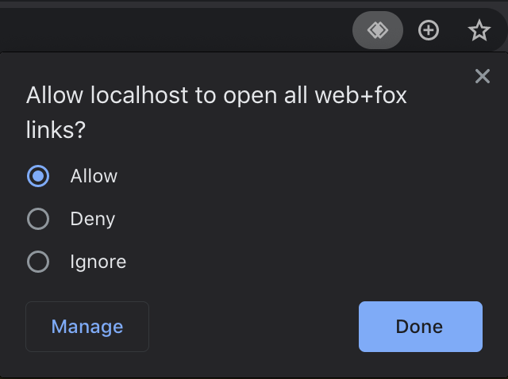

# sw-protocol-handler-test

Testing Chrome SW bug when navigating from protocol handler.

Uses the a2hs (Add to Home Screen) example from MDN's pwa-examples repository.
https://github.com/mdn/pwa-examples

Because HTTPS is a requirement for registering custom protocol handlers, the demo
requires localhost.key and localhost.crt to be able to run express over HTTPS.
See this article from letsencrypt to generate and trust your own certificates
for development purposes:
https://letsencrypt.org/docs/certificates-for-localhost/#making-and-trusting-your-own-certificates

Usage:
```
npm i
node .
```

Reproducing the protocol handler bug:

   1. Open Chrome and navigate to https://localhost:8080/a2hs
   2. Allow the protocol handler by clicking the icon in the address bar:
   
   3. Open the web console, then attempt to open up the PWA via the link: web+fox://test.  Chrome will
   redirect to https://localhost:8080/a2hs/?foxlink=web%2Bfox%3A%2F%2Ftest.

Issue: The service worker fails to recognize that we're on a controlled page, printing the following
error in console:
```
Uncaught (in promise) DOMException: Failed to register a ServiceWorker: The document is in an invalid state.
```

The page fetches will not be intercepted by the service worker.

If you refresh the page (https://localhost:8080/a2hs/?foxlink=web%2Bfox%3A%2F%2Ftest), the service worker
is able to start successfully to intercept fetches.
